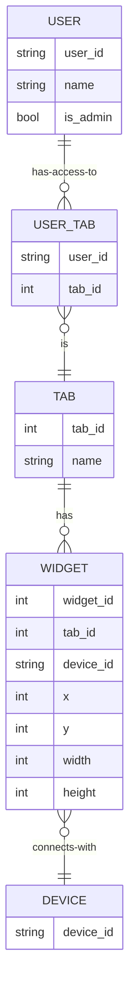

# Nexum

## DB structure:

```mermaid
erDiagram
    USER ||--o{ USER_TAB : has-access-to

    USER {
        string user_id
        string name 
        bool is_admin
    }

    USER_TAB }o--|| TAB : is

    USER_TAB {
        string user_id
        int tab_id
    }

    TAB ||--o{ WIDGET : has

    TAB {
        int tab_id
        string name
    }

    WIDGET }o--|| DEVICE : connects-with

    WIDGET {
        int widget_id
        int tab_id
        string device_id
        int x
        int y
        int width
        int height
    }

    DEVICE {
        string device_id
    }
```
